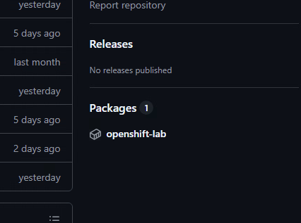

# OpenShift CI/CD Test

This repo contains an example of how to configure application builds and deployments against an OpenShift cluster.
The example is intended to be run locally using OpenShift Local.

GitHub Actions is the primary CI/CD tool in use, but parallels will be drawn with GitLab Pipelines.

## Configuring the Cluster

The following subsections explain...

1. How to build container images using `podman`
2. How to deploy a containerized application using `helm`
3. How to write a simple (composite) GitHub action

### Prerequisites

It's recommended to start with a freshly-installed OpenShift Local cluster.

If you already have an OpenShift Local cluster running, you can delete the existing cluster and create a new one with the following commands.

```shell
crc delete
crc start
```

Also, make sure you're currently logged in with the `kubeadmin` account.

```shell
oc login -u kubeadmin https://api.ctc.testing:6443
```

In order to follow the GitHub Actions track of this tutorial, prepare an empty respository.

Using the GitHub CLI (`gh`) this could be done with the following command.

```shell
gh repo create openshift-cicd-test --public
```

Once created, clone the repo somewhere on your machine; this is where we'll work out of.

## Build a container image

Our goal in this tutorial is to automate deploying an application to the cluster.
We'll use `nginx` as a lightweight, stateless, web application for now.

To practice building containers, we'll "extend" the nginx `nginx-unprivileged` image for our application.
Copy the following contents into `Dockerfile`.

```dockerfile
FROM docker.io/nginxinc/nginx-unprivileged:latest
```

To build the image, run the following command.

```shell
$ podman build .
STEP 1/1: FROM docker.io/nginxinc/nginx-unprivileged:latest
Trying to pull docker.io/nginxinc/nginx-unprivileged:latest...
Getting image source signatures
Copying blob sha256:57cfc71dff455540ee208a6981cc6ee813855240305c47ab43d71eb2d84fc1da
Copying blob sha256:5efcb0ecd7fe7ccac9212d9c57992fd8c45709c67b5cdf633f9c700d448dac62
Copying blob sha256:f16d1bfb7e9cd31bcab80ae237db31b72c4613253855e671bf5fab1d588f6e8b
Copying blob sha256:683f775e06c51bd293757bd7742660775a823701cc6ed6d86a6c30572e6acfde
Copying blob sha256:119d43eec815e5f9a47da3a7d59454581b1e204b0c34db86f171b7ceb3336533
Copying blob sha256:5e815e3c88fb3b206a5773f7b063b6c5262feea6605788185f1c1d210f28d818
Copying blob sha256:c0584c8a972e6ee9da918860d89889cc4aae55aae33a1bb9ad7867cb044360bb
Copying blob sha256:664d64e66ef8fae3cff0c91d4beb30464435c9932aa03ca1a7b1c587658c7b91
Copying config sha256:93336860160f2268feed3f3bada0131c1d8f19ab5e46c3c459043a999a129835
Writing manifest to image destination
COMMIT
--> 93336860160f
93336860160f2268feed3f3bada0131c1d8f19ab5e46c3c459043a999a129835
```

Now that we've verified we can build a container on our local machine, we'll configure a GitHub workflow to automate the process.

## Create a GitHub Actions workflow

Within your new, empty, git repository, create a new YAML file at `.github/workflows`.
This file can have any name, as long as it is located within `.github/workflows`.
We'll use the name `ci.yml` for this example.

```shell
mkdir -p .github/workflows
touch .github/workflows/ci.yml
```

> [!NOTE]
> In GitLab, this would be the `.gitlab-ci.yml` file

First, we'll add some boilerplate to satisfy the minimum requirements of a workflow.
Copy the following YAML into the new workflow file.
If you are working on a branch other than `main`, use that branch instead.

```yaml
name: CI
on:
  push:
    branches:
      # Use whatever branch name you are working off of
      - main

permissions:
  # Allow the workflow to read the repository contents
  contents: read
  # Allow the workflow to push our container image to `ghcr.io`
  packages: write
```

Now we have a valid GitHub workflow to build on.
Next we'll create a job that will build a container image, and push it to `ghcr.io`.

Copy the following YAML below the boilerplate we just added.
Make sure to replace `<your-github-username>` with the **lower-cased** version of your GitHub username!

```diff
# ... elided

permissions:
  contents: read
  packages: write

+ env:
+   # Replace with your GitHub username, lower-cased
+   GITHUB_USERNAME: <your-github-username>
+
+ jobs:
+   build:
+     runs-on: ubuntu-latest
+     steps:
+     - uses: actions/checkout@v5
+
+     - name: Install Podman
+       uses: redhat-actions/podman-install@main
+
+     - name: Build the container image
+       run: podman build . --tag ghcr.io/${{ env.GITHUB_USERNAME }}/nginx:latest
```

> [!NOTE]
> In GitLab we would add content to `.gitlab-ci.yml` like:
>
> ```yaml
> stages:
>   - build
>
> variables:
>   GITHUB_USERNAME: <your-github-username>
>
> build-image:
>   image: quay.io/podman/stable
>   stage: build
>   script:
>     - podman build . --tag ghcr.io/$GITHUB_USERNAME/nginx:latest
> ```

Commit everything we've created up to this point.
We should have two new files, `.github/workflows/ci.yml` and `Dockerfile`.
Push the commit to GitHub, using the same remote branch you used in the workflow `push` trigger.

If everything has been set up correctly, a new workflow run should have been automatically queued in GitHub.
Log in the GitHub web UI, navigate to your repository, and select the "Actions" tab.
You should see a workflow run performing the steps we just defined in our YAML file.

Now, we've automated building our application's container image!
Next, we'll modify the workflow to push to an image registry so that our cluster can pull the new image.

## Push a container image in GitHub Actions

Modify `.github/workflows/ci.yml` to add the following YAML.

```diff
# ... elided

    - name: Install Podman
      uses: redhat-actions/podman-install@main
+
+   - name: Log in to ghcr.io
+     uses: redhat-actions/podman-login@v1
+     with:
+       registry: ghcr.io
+       username: ${{ env.GITHUB_USERNAME }}
+       password: ${{ github.token }}

    - name: Build the container image
      run: podman build . --tag ghcr.io/${{ env.GITHUB_USERNAME }}/nginx:latest
+
+   - name: Push the container image
+     run: podman push ghcr.io/${{ env.GITHUB_USERNAME }}/nginx:latest
```

> [!NOTE]
> In GitLab we would add content to `.gitlab-ci.yml` like:
>
> ```diff
> # ... elieded
>
> build-image:
>   image: quay.io/podman/stable
>   stage: build
> + before_script:
> +   - podman login -u $GITLAB_USER -p $REGISTRY_PASSWORD
>   script:
>     - podman build . --tag ghcr.io/$GITLAB_USER/nginx:latest
> +   - podman push ghcr.io/$GITLAB_USER/nginx:latest
> ```

Commit and push these changes as well.
Now, when our workflow runs it will push the built image to GitHub's container registry!
Once the workflow has completed, navigate to your repository's landing page again and find the "Packages" section.
It is typically located on the right-hand side of the page, below "Releases".



If you don't see the section right away, wait a bit and refresh the page.
New packages can be slow to update in the web UI.

Select your image's "package" from the list to view metadata such as the URI and published tags.
The commands displayed by GitHub use `docker`, but we can replace it with `podman` for every command run in this tutorial.

We'll pull the image as a quick sanity check.
Run the following command, replacing the image with your custom image name.

```shell
$ podman pull ghcr.io/<your-github-username>/nginx:latest
Trying to pull ghcr.io/<your-github-username>/nginx:latest...
Getting image source signatures
Copying blob sha256:34c42acdc6abce4fb775913eaff45b0ba43e061fa0a0079d18f2242a122cd4b2
Copying blob sha256:d7696ad810223b99a0cd3bafdd896355d8efaf59bc8cffd96d26833f05b84cb0
Copying blob sha256:ea368c811a9e76ca60f51346f41e6cd8dcb00fa9c1b8ad9e151c7309a88f4953
Copying blob sha256:5dd5dbcfe763c67dd6fd39c13b9421fcfa62f425fc0c99ec64cfa669c6c0b4ed
Copying blob sha256:033e6114b40efd338043aa417866810fd96dddcc5394aca79ea402fdc925cb3e
Copying blob sha256:490702eb1db134dfcfb5e7be59d65d25ff0b1fdca9b05e4b3c2e206faa3273c3
Copying blob sha256:0971f88e0caa0faeceaebfda1bf84aee73bdbcd92631119032b827bb05a1a7ab
Copying config sha256:4af177a024eb8a1e43f4fb6c66735bb8260115cb5925a64f51673219bd97c144
Writing manifest to image destination
4af177a024eb8a1e43f4fb6c66735bb8260115cb5925a64f51673219bd97c144
```

Now that we have a container image in a public container registry, we can deploy it to our cluster!

## Create kubernetes manifests

Kubernetes offers many methods of deploying code to a cluster, we'll use [Helm](https://helm.sh/) here because it allows us to create a deployment "package".
In the production environment, this package could conceivably be managed by an infrastructure team and provided to development teams as a paved-path for deployment.
The default helm template also contains all the resources we'll need to quickly get our app running.

Run the following command to create a new Helm chart located at `./charts/nginx-app`:

```shell
$ helm create charts/nginx-app
Creating charts/nginx-app
```

This command will have generated quite a few files, but we'll focus on just a couple of them.

- `charts/nxing-app/Chart.yaml` contains the chart package definition. We don't need to worry about its contents right now, but know that it describes the package so `helm` knows how to work with it.
- `charts/nginx-app/values.yaml` contains the default [Helm "values"](https://helm.sh/docs/chart_template_guide/values_files/) or, in other words, the configuration we supply to helm when we're deploying.
- `charts/nginx-app/templates/deployment.yaml` contains the kubernetes "Deployment" resource that represents the deployment of our application on the cluster.

Within `charts/nginx-app/templates/deployment.yaml` pay attention to the line that looks like this:

```yaml
image: "{{ .Values.image.repository }}:{{ .Values.image.tag | default .Chart.AppVersion }}"
```

> [!TIP]
> With the template created by `helm` v3.19.1 this is located on line 41.

The current value may look a little cryptic as it is using the [helm template syntax](https://helm.sh/docs/topics/charts#templates-and-values), but we can gloss over that for now.
The important part is that this line specifies the image that the application will use when it is deployed.
We'll need to teach helm where to find our custom image when we run the deployment command in the next section.
We can see that we'll need to give it `.Values.image.repository` and `.Values.image.tag`.

Helm allows us to supply configuration from a few different sources, we'll use the file-based configuration here.
As mentioned above, the default configuration lives in `charts/nginx-app/values.yaml`.
This file is very useful to reference when constructing your own `values.yaml` file.

Let's create our own values file now, create `values.yaml` with the following contents.
As before, replace `<your-github-username>` with the lower-cased version of your username so that `repository` matches your image name.

```yaml
image:
  repostory: ghcr.io/<your-github-username>/nginx
  tag: latest
service:
  port: 8080
```

We set `port` to `8080` since this is the default port used by `nginxinc/nginx-unprivileged`.

This configuration will be merged with the default configuration when we create the helm release.
In effect, these values _override_ the default values.
Check out the [Helm documentation](https://helm.sh/docs/chart_template_guide/values_files/) for more information on values.

## Deploy the application to the cluster

For this section we'll need to diverge from standard CI/CD flows so that we can run the application on our OpenShift local cluster.
We'll add more GitHub actions YAML to see what it looks like, but we'll disable these steps and execute equivalent commands on our local machine.
This keeps the tutorial light and focused, the reasoning is elaborated on in the [section below](#cicd-runners-and-networking).

Add the following YAML to our workflow file:

```diff
# ... elided

    - name: Push the container image
      run: podman push ghcr.io/${{ env.GITHUB_USERNAME }}/nginx:latest
+
+   - name: Authenticate and set context
+     uses: redhat-actions/oc-login@v1
+     with:
+       openshift_server_url: https://api.crc.testing:6443
+       openshift_token: ${{ secrets.OPENSHIFT_TOKEN }}
+
+   - name: Deploy the application
+     run: |
+       helm upgrade nginx-app --install ./charts/nginx-app \
+         --namespace openshift-lab \
+         --create-namespace \
+         --values ./values.yaml
```

> [!NOTE]
> In GitLab we would add content to `.gitlab-ci.yml` like:
>
> ```diff
> stages:
>   - build
> + - deploy
>
> # ... elided
>
> +deploy-image:
> +  image: docker.io/alpine/helm:3.19.1
> +  stage: deploy
> +  before_script:
> +    - oc login --token $OPENSHIFT_TOKEN $OPENSHIFT_URL
> +  script:
> +    - helm upgrade nginx-app --install ./charts/nginx-app # ...
> ```

First we log in to the cluster.
In production, this would use the credentials of a pre-configured cluster service account with permissions to deploy manifests to a single namespace.
Auth is outside the scope of this tutorial, but we'll cover it heavily elsewhere.

Lets break down what this command is doing.

- `upgrade` tells helm we want to deploy changes
- `nginx-app` is an arbitrary name we give to the helm **release**
- `--install` tells helm to install the release if it doesn't exist yet
- `./charts/nginx-app` points to the chart we want to deploy. This is usually a repository name of the form `repository/chart` or an OCI url of the form `oci://repository/chart` but local file paths work as well.
- `--namespace openshift-lab` tells `helm` which kubernetes namespace we want to deploy to, in this case "openshift-lab"
- `--create-namespace` tells helm to create the namespace if it does not exist
- `--values ./values.yaml` tells helm to source configuration from the `./values.yaml` file we created earlier

You can verify the server URL with your local machine by runnning the following command.
This value doesn't actually matter, since we'll be performing the deployment manually instead of the runner.

```shell
$ oc whoami --show-server
https://api.crc.testing:6443
```

If GitHub Actions were actually running our workflow, we would need to create a secret for `${{ secrets.OPENSHIFT_TOKEN }}`.
We can get this value for our local cluster with the following command:

```shell
$ oc whoami --show-token
sha256~tHi55iSF4k3m-hs3LlOf6X6VrDKIsDdU7kiN2sGtJC4
```

Feel free to discard this token, we won't actually use it.

### Run the deployment manually

We'll use `helm` to deploy manually since the GitHub hosted runners can't connect to our machine.
We performed the `oc login` step earlier, so we're already authenticated.
Take the `helm` command from our workflow file and execute it on your machine.

```shell
$ helm upgrade nginx-app --install ./charts/nginx-app --namespace openshift-lab --create-namespace --set image.repository=ghcr.io/<your-github-username>/nginx --set image.tag=latest --set service.port=8080
Release "nginx-app" does not exist. Installing it now.
NAME: nginx-app
LAST DEPLOYED: Wed Jan 21 13:07:26 2026
NAMESPACE: openshift-lab
STATUS: deployed
REVISION: 1
NOTES:
1. Get the application URL by running these commands:
  export POD_NAME=$(kubectl get pods --namespace openshift-lab -l "app.kubernetes.io/name=nginx-app,app.kubernetes.io/instance=nginx-app" -o jsonpath="{.items[0].metadata.name}")
  export CONTAINER_PORT=$(kubectl get pod --namespace openshift-lab $POD_NAME -o jsonpath="{.spec.containers[0].ports[0].containerPort}")
  echo "Visit http://127.0.0.1:8080 to use your application"
  kubectl --namespace openshift-lab port-forward $POD_NAME 8080:$CONTAINER_PORT
```

If everything was successful, we should now have a single nginx pod running!

> [!NOTE]
> You'll notice the upgrade command printed some notes after it completed, including some commands to connect to the application.
> Feel free to execute these if you desire, but we won't go into the specifics here.
> The commands reference `kubectl`, but you can safely replace that with `oc`, as the `oc` tool implements the same cluster commands.

For our purposes, we can verify the deployment was successful with the following commands.

First we list all the pods in the `openshift-lab` namespace:

```shell
$ oc get pods --namespace openshift-lab
NAME                         READY   STATUS    RESTARTS   AGE
nginx-app-7cc9d9885d-8dmsk   1/1     Running   0          5s
```

Then we use the pod name to inspect its logs:

```shell
$ oc logs --namespace openshift-lab nginx-app-7cc9d9885d-8dmsk
/docker-entrypoint.sh: /docker-entrypoint.d/ is not empty, will attempt to perform configuration
/docker-entrypoint.sh: Looking for shell scripts in /docker-entrypoint.d/
/docker-entrypoint.sh: Launching /docker-entrypoint.d/10-listen-on-ipv6-by-default.sh
10-listen-on-ipv6-by-default.sh: info: Getting the checksum of /etc/nginx/conf.d/default.conf
10-listen-on-ipv6-by-default.sh: info: /etc/nginx/conf.d/default.conf differs from the packaged version
/docker-entrypoint.sh: Sourcing /docker-entrypoint.d/15-local-resolvers.envsh
/docker-entrypoint.sh: Launching /docker-entrypoint.d/20-envsubst-on-templates.sh
/docker-entrypoint.sh: Launching /docker-entrypoint.d/30-tune-worker-processes.sh
/docker-entrypoint.sh: Configuration complete; ready for start up
2026/01/21 19:27:27 [notice] 1#1: using the "epoll" event method
2026/01/21 19:27:27 [notice] 1#1: nginx/1.29.3
2026/01/21 19:27:27 [notice] 1#1: built by gcc 14.2.0 (Debian 14.2.0-19) 
2026/01/21 19:27:27 [notice] 1#1: OS: Linux 5.14.0-570.66.1.el9_6.x86_64
2026/01/21 19:27:27 [notice] 1#1: getrlimit(RLIMIT_NOFILE): 1048576:1048576
2026/01/21 19:27:27 [notice] 1#1: start worker processes
2026/01/21 19:27:27 [notice] 1#1: start worker process 23
2026/01/21 19:27:27 [notice] 1#1: start worker process 24
2026/01/21 19:27:27 [notice] 1#1: start worker process 25
2026/01/21 19:27:27 [notice] 1#1: start worker process 26
10.217.0.2 - - [21/Jan/2026:19:27:28 +0000] "GET / HTTP/1.1" 200 615 "-" "kube-probe/1.33" "-"
```

Your output will likely look different, but you should see one or more lines like `"GET / HTTP/1.1" 200`.

With that, we've successfully automated a (nearly) full application deployment lifecycle!

### CI/CD, Runners, and Networking

The machine running our GitHub Actions workflows needs to be able to send network requests to the kubernetes API server in order to perform deployment tasks.
Our OpenShift Local clusters are running locally, likely behind a firewall and one or more layers of NAT, and the GitHub hosted runners we're using are running somewhere else entirely.
We could perform some trickery to poke a hole and allow the runners access to our cluster, but this carries security risks and is outside the scope of this tutorial.

We focus on a "push" based flow in order to more accurately model the production workflow, but alternatively we could use a "pull" based flow.
In this model, the cluster watches for changes to some upstream source, a GitHub repository in our case, and pulls them in automatically when they occur.
Therefore we don't need to configure anything special for the CI/CD runner, it only needs to be able to push to the container registry.
This is usually referred to as "GitOps" and some popular tools that support this are `flux` and `argocd`.

## Teardown

Optionally, to tear down the resources we created we can run a few commands.

Uninstall the `nginx-app` helm release:

```shell
$ helm uninstall nginx-app --namespace openshift-lab
release "nginx-app" uninstalled
```

Delete the GitHub repository:

```shell
gh repo delete <your-github-repository>
```

## Bonus Material - Custom Actions

Our final GitHub workflow wasn't too terribly long, but it contained mostly boilerplate that will be common to all application deployments.
We can further abstract out this boilerplate from our workflow using [composite actions](https://docs.github.com/en/actions/tutorials/create-actions/create-a-composite-action).

> [!NOTE]
> In GitLab, we could use [the include directive](https://docs.gitlab.com/ci/yaml/includes/).

Create a new file at `./actions/build-image/action.yml` with the following contents:

```yaml
name: Build Container Image
inputs:
  name:
    description: 'Name of the container image to build'
    required: true
    default: 'my-container-image'
  github-username:
    description: 'GitHub username for authentication'
    required: true
  github-token:
    description: 'GitHub token for authentication'
    required: true

runs:
  using: composite
  steps:
    - uses: redhat-actions/podman-install@main
      with:
        github-token: ${{ inputs.github-token }}

    - uses: redhat-actions/podman-login@v1
      with:
        registry: ghcr.io
        username: ${{ inputs.github-username }}
        password: ${{ inputs.github-token }}

    - run: podman build . --tag ghcr.io/${{ inputs.github-username }}/${{ inputs.name }}:latest
      shell: bash

    - run: podman push ghcr.io/${{ inputs.github-username }}/${{ inputs.name }}:latest
      shell: bash
```

This is a lot of the same content we used in `./.github/workflows/ci.yml`.
Of note, we now have `inputs:` that consumers of this action can use to customize details about the image build.
In each of the `steps` we've replaced our "hardcoded" values with input expressions, like `${{ inputs.name }}`.

> [!NOTE]
> We also added `using: composite` and a few `shell: bash` lines.
> These are quirks of composite actions, the steps will run the same as they did in our top-level workflow.

Now, we can go back into `./.github/workflows/ci.yml` and update it to use our new composite action.

Make the following changes to `./.github/workflows/ci.yml`:

```diff
# ... elided

-   - name: Install Podman
-     uses: redhat-actions/podman-install@main
-
-   - name: Log in to ghcr.io
-     uses: redhat-actions/podman-login@v1
-     with:
-       registry: ghcr.io
-       username: ${{ env.GITHUB_USERNAME }}
-       password: ${{ github.token }}
-
-   - name: Build the container image
-     run: podman build . --tag ghcr.io/${{ env.GITHUB_USERNAME }}/nginx:latest
-
-   - name: Push the container image
-     run: podman push ghcr.io/${{ env.GITHUB_USERNAME }}/nginx:latest
+   - name: Build container image
+     uses: ./actions/build-image
+     with:
+       name: nginx
+       github-username: ${{ env.GITHUB_USERNAME }}
+       github-token: ${{ secrets.GITHUB_TOKEN }}
```

Commit and push the changes.
Our workflow should work exactly the same as it did before, but now we can share our deployment steps with other applications.
We put the action in a local path within the current repository for this example, but actions can live (almost) anywhere.

It is common to host actions in their own repository, and refer to them using the repository name and version tag.
This is actually what all the steps with `uses:` are doing!
For example, here is the [action.yml for actions/checkout@v5](https://github.com/actions/checkout/blob/v5/action.yml).
